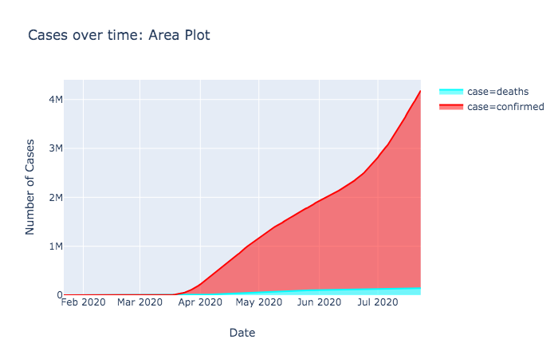
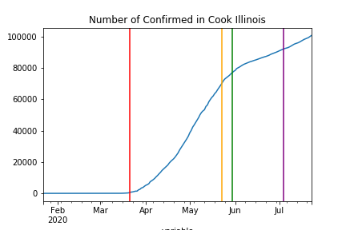
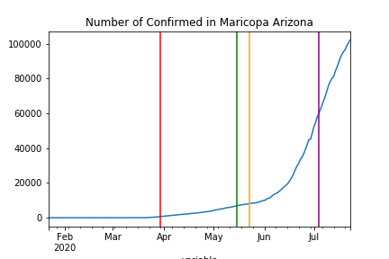
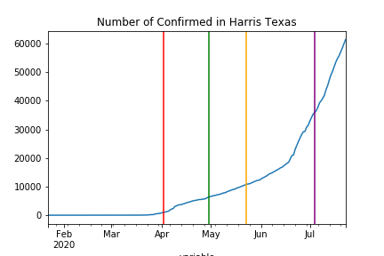
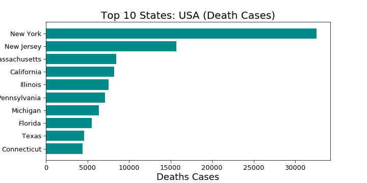
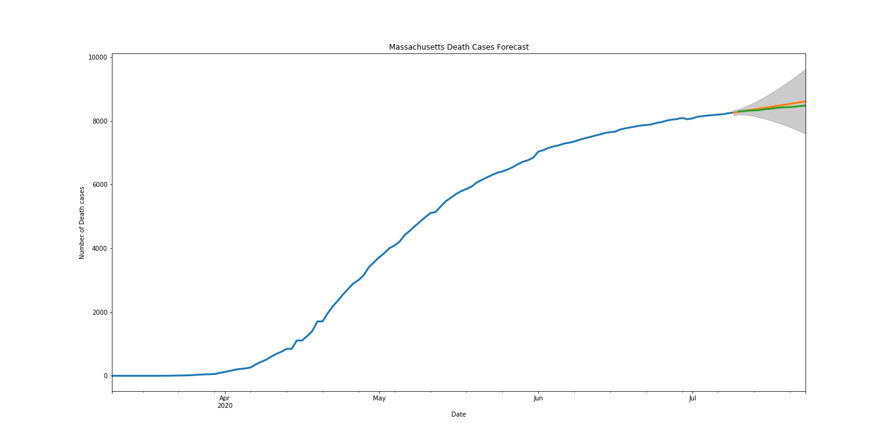
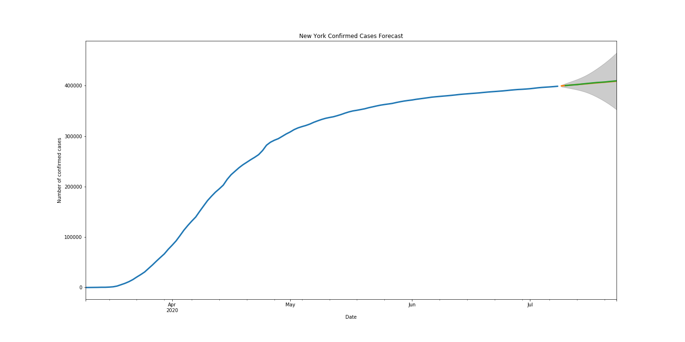
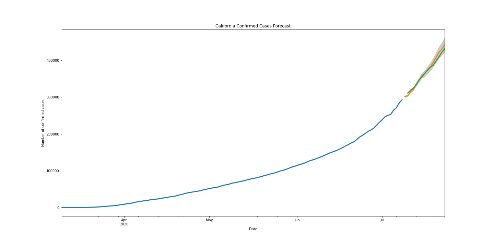

# Covid-19 Time-Series Analysis
#### Study By
#### JD Kim - Muriel Kosaka -  Gabe Arnold

[Understanding Data](#understanding)
[Models Used](#models_used)
[Final Model](#final_model)
[Model Forecasts](#model_forecasts)
[Recommendations](#recommendations)

<h3 name='understanding'>Understanding Our Data</h3>

Our dataset was collected from [JHU GitHub](https://github.com/CSSEGISandData/COVID-19/tree/master/csse_covid_19_data). It contains up to date information regarding the latest COVID-19 counts. Data includes international locations, as well as updated data from the United States.

Since the beginnning of the year COVID-19 has spread across America. The first case in the United States was recorded in January 2020. As of July 30, 2020 millions of people have been infected, and over 150,000 people have died from the virus.

Our goal is to build a model to project death rates for cities in America. After and see if certain actions can be made to decrease the rate of the curve.

<h3 name='models_used'>Models Used</h3>
    
<ul>
    <li>ARMA</li>    
    <li>ARIMA</li>
    <li>SARIMAX</li>
</ul>

<h6 name = 'final_model'>Final Model</h6>

The final model selected was SARIMAX model. The RMSE Score for the National Cases Confirmed model was 15,325. The RMSE Score for the National Death Model was 487.

<h3 name='findings>Findings</h3>

<h6>Confirmed Cases </h6>

We are seeing that highly populated areas were hit extremely hard. We believe that it is a result of the dense population and high transmission rate.

New York City and Cook County (Chicago), had large jumps in the number of people that were initially infected during the lockdown phase, however, data shows a smoothing in the recent rate of cases, even after reopening. It should also be noted that both of these cities instituted a lockdown relatively early and longer in the US.

    

Recently, the cities of Los Angeles, Harris County Texas (Dallas), and Maricopa (Phoenix), have seen large increases in the number of people that have recently contracted the disease. Los Angeles, even though they instituted a longer lockdown, has faced a rapid increase in the number of confirmed cases. We noticed that Harris County Texas and Maricopa had shorter lockdown periods and a rapid increase in cases after reopening.

Additionally, we noticed in median populated (~12,000 People) regions, that had shorter lockdown periods are experiencing high rates of contact.

Areas with small populations (Less than 1,000 People), face small amounts of Contamination Cases.

In large (>4,000,000) and median populated regions generally saw a spike after the Fourth of July.

<h6>Death Cases</h6>

Death cases were similar to confirmed cases. Large metropolitans that were hit early experienced very high death rates. As we transition to overall state data, we can see New York, California, and Massachusetts are all leading the nation in COVID-19 deaths. 

    

<h3 name='model_forecasts'>Model Forecasts</h3>

Currently, our models predicted that there will be a continuation of the upward trends in both confirmed cases and death cases, however the amount varied depending on the location. 

<h3 name='recommendations'>Recommendations</h3>

Based on the analysis performed, it is recommended that cities institute some measure of lockdown protocal. As this has shown promise in mitigating the cases and and keeping the death rate down.

